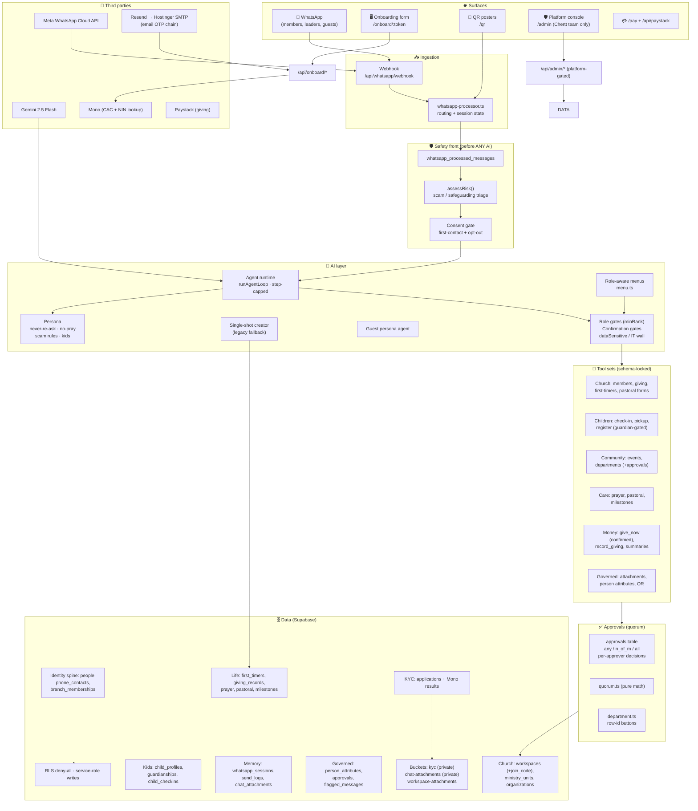
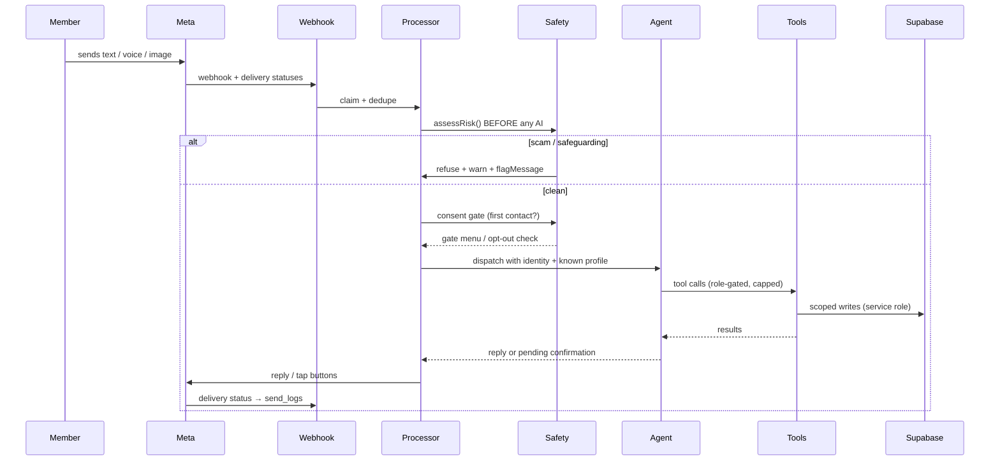
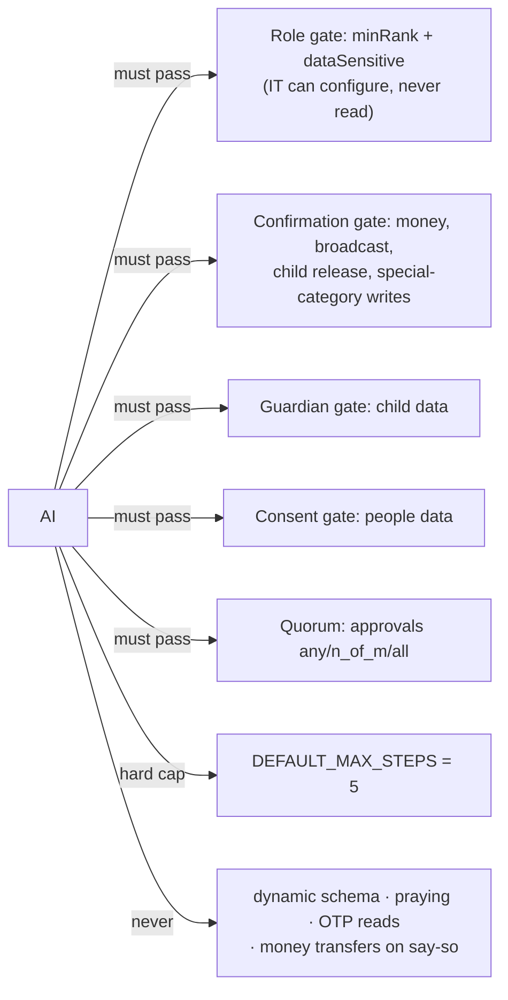

# Chertt — Architecture Tree (2026-08-15)

> WhatsApp is the product. The web is the platform console. Everything funnels
> through guarded services into a deny-all Supabase schema.



## Data flow (one inbound WhatsApp message)



## Security rails (what the AI cannot cross)



## Repository tree (what lives where)

```
cherrt/
├── src/
│   ├── app/
│   │   ├── api/whatsapp/webhook/       # Meta entry (messages + statuses)
│   │   ├── api/onboard/                # KYC form, email-code, submit
│   │   ├── api/admin/                  # platform console APIs + kyc-health
│   │   ├── api/pay|paystack/           # giving
│   │   ├── onboard/[token]/            # church onboarding form (validated)
│   │   ├── qr/                         # printable QR posters + /qr/img
│   │   └── admin/                      # console: overview, churches, people,
│   │                                   #   kyc, flagged, settings(+health)
│   ├── components/admin/               # Kimi design system + charts + InfoTip
│   ├── components/{shell,shared,auth,forms,providers}/
│   └── lib/services/
│       ├── agent/                      # runtime, persona, tools, menu, access,
│       │                               #   audit, guardrails.test
│       ├── safety/                     # risk.ts (scam/safeguarding), flags.ts
│       ├── approvals/                  # quorum.ts, department.ts
│       ├── identity/                   # people, provisioning, otp, role-catalog,
│       │                               #   assign-role-flow
│       ├── kyc/                        # applications, mono, checks, review,
│       │                               #   email-otp (SMTP→Resend), storage
│       ├── privacy/                    # consent, opt-out
│       └── whatsapp-*.ts, whatsapp.ts  # processor, session, workspace, send
├── supabase/migrations/                # 60+ versioned SQL files (all applied)
├── scripts/                            # reset-demo.mjs, seed-demo.mjs
├── docs/                               # demo-presentation.md, prompts, specs
└── CHRONICLE.md                        # the living log
```

## Approvals: quorum rules

| quorum | rule |
|---|---|
| `any` | first decision decides (department joins) |
| `n_of_m` | `required` approvals decide; too many declines make it unreachable |
| `all` | every approver must approve; one decline kills it |

Every decision is recorded per approver (`approvals.decisions`) — no silent
first-come-wins, and `/admin` can show the trail.
